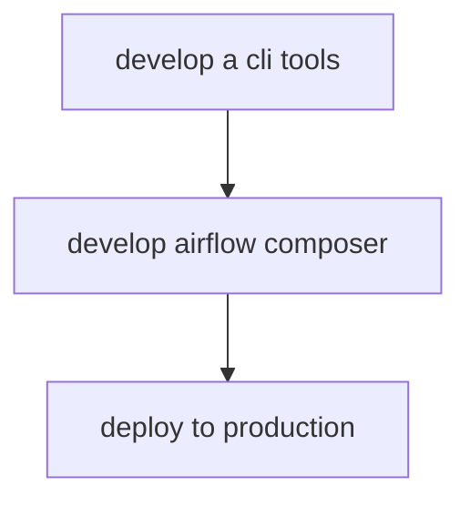

# airflow-tm1-implementation
this is the TM1 airflow implementation example

# File Structure 
```bash
.
├── bin # execution or snippet 
│   ├── update_JWT.processes #update JWT token for TM1
│   ├── airflow_variables.json # airflow variables for TM1
├── airflow_tm1 #project module folder
│   ├── __init__.py
│   ├── interface.py
│   ├── cli # command line interface
│   │   ├── __init__.py
│   │   ├── task_1.py
├── dags #airflow dag folder
│   ├── constant.py # some configuration for global usage 
│   ├── task_1.py # airflow dag file
```

# Development Workflow 


